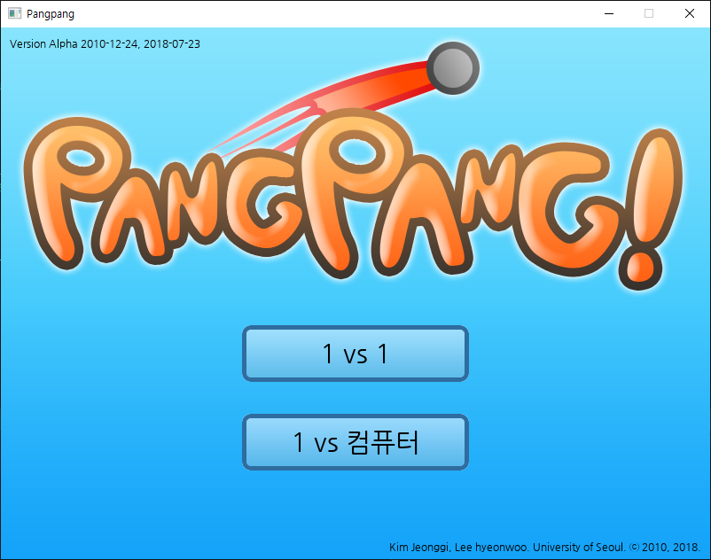
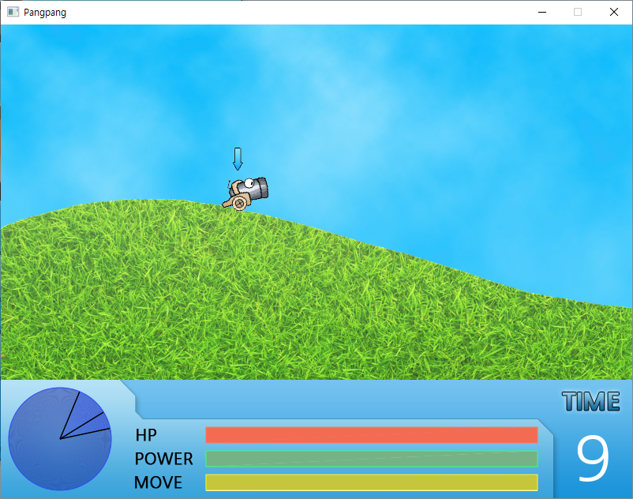

PangPang
=================================
# Introduction

This is my final term project in lecture of C programming language. (what?)
Made with my friend Kim. He made the infrastructure and game logic and I made sprite engine and widgets.

# Screenshots




# How to play

This game has two menus.
 
* 1vs1 : Person to person mode
* 1vs컴퓨터 : AI mode

Dragging a mouse to move camera horizontally and vertically.
Press left or right arrow key to move left or right.
Press up or bottom arrow key to adjust the angle.
Press and keep a space bar to charge the guage and release the key to shoot.

Have fun!

# How to build

This code is originally made in 2010. I modified the project settings to make it possible to compile in 2018.
win32 directory contains Visual Studio project. (VS 2017 recommended)
Before opening project, you need to install C++ releated components. You also have to install ATL, MFC and Windows 8.1 SDK.
Boost libraries are excluded because of its huge disk space. You have to add includes and libraries manually.

```
* directories should be like this
  + win32
    + boost
      + include
      + lib
```

The project settings and dependies is already configured. So, you can just press [>] button to build and run!
Currently this project supports x86 only. x64 is not tested.

# To-Do

* Mac support
* Change rendering API (OpenGL 2.1 to Core or DirectX)